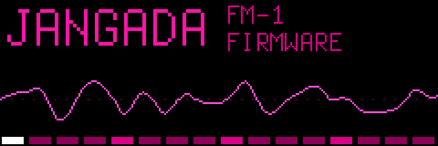

<p align="center"></p>

<p align="center">
<b>English</b> · <a href="README.pt-BR.md">Português</a><br>
<a href="https://github.com/zednaked/jangada/actions/workflows/ci.yml"></a>


</p>

# Jangada 🛶

**Alternative firmware for the M-VAVE FM-1** — nine synth engines, a superwave analog, a
modulation matrix, latched drones, ratchets and four tracks, on a €70 pocket synth.
A fork of [Felucca](https://github.com/hugelton/Felucca) by Leo Kuroshita (Hügelton Instruments).
A *felucca* is a Nile sailboat; a *jangada* is the Brazilian one.

> **Alpha.** Use at your own risk. The FM-1's boot area is never touched, and you can go back to
> the official firmware at any time.

## Listen

Rendered by the firmware's own DSP (the same C code, run on a PC):

| Dark / industrial | Drones | Superwave |
|---|---|---|
| [RUST BASS](docs/sounds/rust-bass.mp3) | [DRONE SAW](docs/sounds/drone-saw.mp3) | [SUPER SAW](docs/sounds/super-saw.mp3) |
| [HURT PAD](docs/sounds/hurt-pad.mp3) | [DRONE RING](docs/sounds/drone-ring.mp3) | [SUPER PAD](docs/sounds/super-pad.mp3) |
| [GRIND LEAD](docs/sounds/grind-lead.mp3) | [DRONE FM](docs/sounds/drone-fm.mp3) | [HP SHIMMER](docs/sounds/hp-shimmer.mp3) |
| [MACHINE](docs/sounds/machine.mp3) | [DRONE DUST](docs/sounds/drone-dust.mp3) | [four tracks at once](docs/sounds/four-tracks.mp3) |
| [METAL HIT](docs/sounds/metal-hit.mp3) | [DRONE VOX](docs/sounds/drone-vox.mp3) | |
| [BROKEN BELL](docs/sounds/broken-bell.mp3) · [STATIC](docs/sounds/static.mp3) | [DRONE ORGAN](docs/sounds/drone-organ.mp3) | |
| [QUIET KEYS](docs/sounds/quiet-keys.mp3) · [BROKEN KEY](docs/sounds/broken-key.mp3) | | |
| [GHOST KEYS](docs/sounds/ghost-keys.mp3) · [DIRTY ORGAN](docs/sounds/dirty-organ.mp3) | | |

## Install

**Linux** — plug the FM-1 in with a USB data cable:

```
./instalar-linux.sh                    # the latest release
./instalar-linux.sh --original         # back to M-VAVE's official firmware (V15)
./instalar-linux.sh --info             # what the FM-1 is running
./instalar-linux.sh --console          # serial console access (a udev rule, asks for sudo)
```

It sets up its own Python environment (`mido` + `python-rtmidi`) in `~/.local/share/jangada/`.
**Mac / Windows**: Felucca's [web installer](https://hugelton.github.io/Felucca/) (Chrome or Edge)
installs the `.fwsc` from the [releases](https://github.com/zednaked/jangada/releases) too.

## What's new over Felucca

### Sound
- **A bigger ANALOG** (EDIT 3 / 4): **SUPR** superwave (up to 6 detuned copies of the
  oscillator), **SDTN** spread, **SUB** a square an octave down, **DRFT** slow per-voice drift,
  **FTYP** LP12 / LP24 / BP / HP. With many voices the superwave keeps fewer copies, to fit the
  CPU (8 voices of SUPER SAW: 55 % on the FM-1).
- **Modulation matrix**: LFO button → pages **MOD 1–4**. Each slot: source (LFO, ENV, VEL, KEY,
  RND) → target (filter, pitch, shape or any engine parameter) × amount.
- **16 parameters per engine** (Felucca has 8).
- **20 new presets**: dark and industrial textures, superwaves and six drones.
- The GM kit's **hi-hats and crash** play their own samples (they sounded like toms).

### Drones
The DRONE presets run the arpeggiator in **RPT** every **4 bars** with **HOLD**: play a chord,
let go, and it keeps breathing on its own — also while you play the other tracks.
- **Hold ARP** → DRONE OFF: the latched chords are released (they fade with the preset).
- **Hold ARP again** → SILENCE: the tails stop now.

To sequence a drone: arp OFF, PATTERN **DIV 4BAR**, one chord a step (each step lasts 4 bars).

### Arpeggiator and sequencer
- Arp modes **UDI** (up-down, ends repeated) and **RPT** (the whole chord each step); divisions
  **1/2, 1/1, 2BAR, 4BAR** (sequencer too).
- **STEP 2** page: **RTCH** ratchet x1–x4 and **CHNC** chance 100/75/50/25 % per step.

### Tracks
- **Track 4: DRUM or SYNTH.** On **TRACKS**, pick track 4 with ALGORITHM and turn **knob 1
  (TYPE)**: SYNTH makes it a fourth synth part (engine, preset, arp, sequencer, MIDI channel 4);
  DRUM brings the GM kit back.

### Screen and storage
- The **CHOQUE** palette (shocking pink) by default; the others stay in the menu (hold HOME → COLOR).
- Projects (**JNG1**) and user presets (**UPB2**) store every value with a **stable key**:
  parameters can be added or moved without losing what you saved. Felucca's projects and
  presets are read and converted.

## Tools

| | |
|---|---|
| `tools/fm1_console.py status` | CPU, audio, USB, battery |
| `tools/fm1_console.py check` | on-device test: CPU peak, late audio, resets |
| `tools/fm1_console.py voices` | what sounds on each track, and why |
| `tools/fm1_console.py preset E I [T]` | load preset I of engine E on track T |
| `tools/fm1_console.py t4 synth\|drum` | track 4's type |
| `tools/fm1_console.py droneoff` | as holding ARP |
| `tools/fm1_console.py color CHOQUE` | the screen palette |

## Build and test

See [BUILDING.md](BUILDING.md). On Linux x86-64 JieLi's toolchain runs natively, no Docker:

```
tools/get_toolchain.sh        # the toolchain, in ~/.jieli
tools/get_sdk_files.sh        # only the 3 files of the AC79 SDK the package needs
./build.sh                    # build/felucca.fwsc
sh tests/run_tests.sh         # every test, on the PC
```

- **Reproducible builds**: the date comes from the last commit; two builds give the same bytes.
- The tests cover the sound (fingerprinted renders of every preset), health (clipping, DC, stuck
  notes), CPU budgets (instruction counters on Linux and the Mac), storage formats, arp, steps,
  the matrix, track 4, the installer and the web editor, whose mock tables are generated from
  the firmware (`tools/gen_editor_tables.py`).
- **CI** on every push; a `vX.Y[-suffix]` tag publishes the `.fwsc` in a release.

## Next

- A **6-operator FM** engine that loads DX7 patches (a port of msfa / Dexed).
- Full MIDI (pitch bend, sustain, clock), `.syx` preset backup.
- A subtle UI pass, for legibility.

Fixes that help everyone also go upstream to Felucca as pull requests.

## Credits and license

Jangada is GPL-3.0-only, as Felucca is. The original work is **Leo Kuroshita's (@kurogedelic),
Hügelton Instruments** — see [README.felucca.md](README.felucca.md) and [LICENSING.md](LICENSING.md)
for the full credits (fonts, samples, engines).

M-VAVE and FM-1 are trademarks of their owners. Jangada is not affiliated with or endorsed by
them, nor by Felucca.
